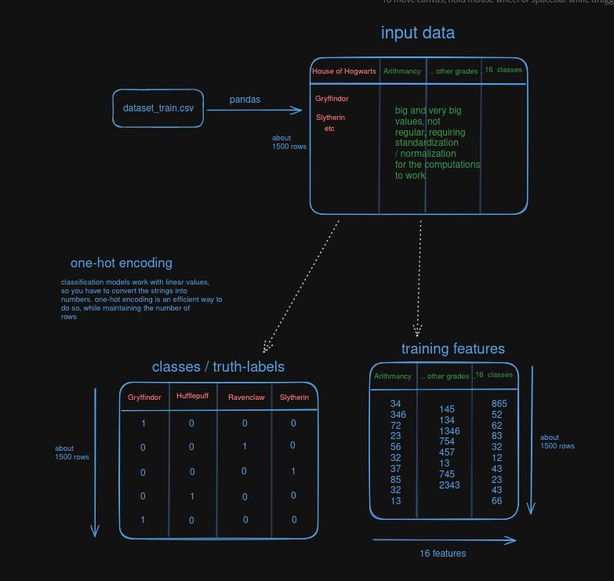

# doing softmax for DLSR
softmax is another name for multi-class logistic regression
logistic regression basically classifies inputs in two classes, with the sigmoid function (weird name to just determine if 1 or 0)
with softmax function it outputs a probability distribution (is it more likely to end up here or here or there)

todo:
- [x] understand and implement cost function
- [x] review again gradient descent and backpropagation, then implement
- [ ] do tutorial / visual breakdown of what's going in all the computation within

